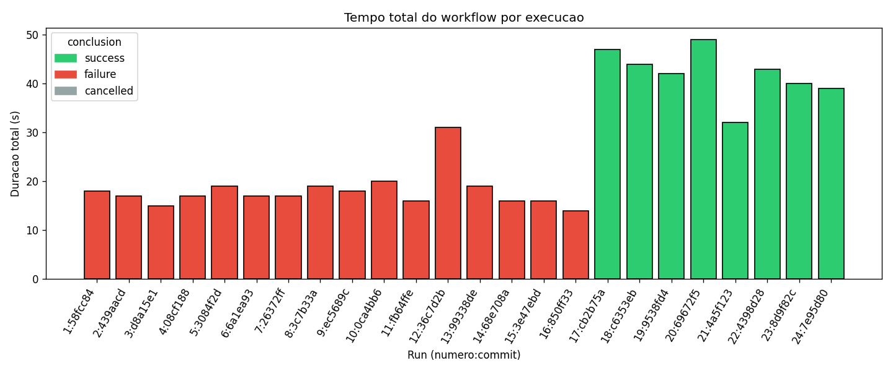
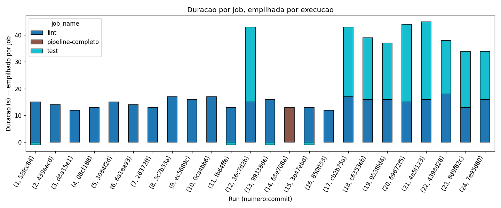
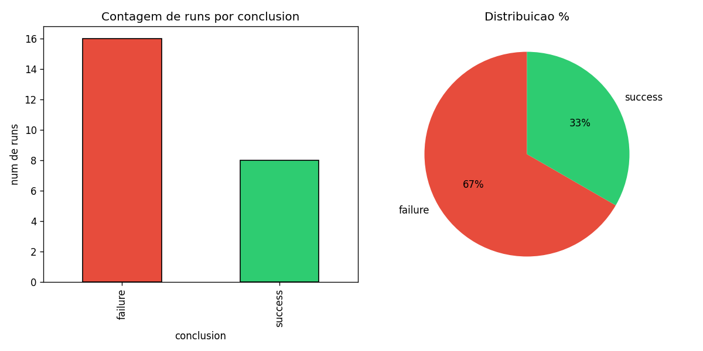
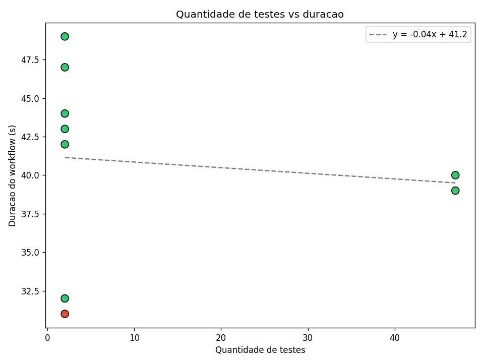
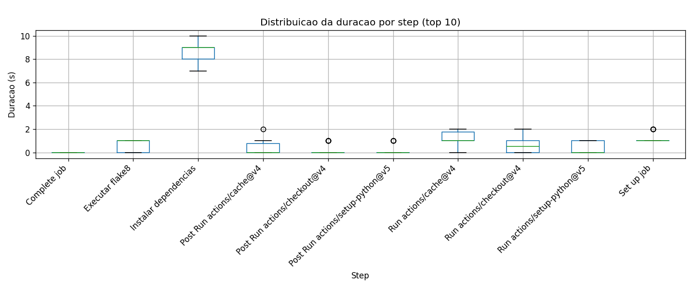

# Relatório — Ponderada CI/CD: Análise de Pipeline

**Autor:** Vinicius Maciel Flor
**Data:** 2026-06-08
**Repo:** [viniciusmflor/ponderada-pipeline-cicd](https://github.com/viniciusmflor/ponderada-pipeline-cicd)
**Workflow:** [`.github/workflows/ci.yml`](https://github.com/viniciusmflor/ponderada-pipeline-cicd/blob/experimento-cicd/.github/workflows/ci.yml)
**Branch:** [`experimento-cicd`](https://github.com/viniciusmflor/ponderada-pipeline-cicd/tree/experimento-cicd)

---

## 1. Introdução

Este relatório apresenta os resultados do experimento de instrumentação e análise de um pipeline CI/CD no GitHub Actions. O projeto base é uma API FastAPI (Python 3.12) com testes pytest, originalmente desenvolvida na ponderada de testes (ponderada-testes-ovidio).

O pipeline foi configurado com **2 jobs sequenciais** (lint → test), instrumentado para emitir artefatos com métricas de teste, e executado **24 vezes** com variações controladas para investigar:

- Impacto de cache de dependências
- Efeito do paralelismo vs execução sequencial
- Comportamento em cenários de falha e recovery
- Relação entre quantidade de testes e duração do pipeline

A coleta foi feita por script Python próprio (`analytics/collect_metrics.py`) via GitHub API. A visualização por `analytics/generate_charts.py` com matplotlib/pandas.

---

## 2. Metodologia

### Stack

- **Runtime:** Python 3.12, FastAPI 0.115, pytest 8.3, flake8 7.1
- **CI:** GitHub Actions (free tier, repo público)
- **Coleta:** Python 3.12 com `requests`, `pandas`, `matplotlib`
- **Trigger:** push em `experimento-cicd`

### Pipeline (versão baseline)

```yaml
jobs:
  lint:  [checkout, setup-python 3.12, cache pip, pip install, flake8]
  test:  [checkout, setup-python 3.12, cache pip, pip install, pytest --junitxml, gerar test-metrics.json, upload-artifact]
```

### Variações executadas (24 runs)

| # | Variação | Commit | Esperado | Resultado |
|---|---|---|---|---|
| 1 | setup inicial | `58fcc84` | success | **failure** (F401 imports) |
| 2 | cache frio (rerun) | `439aacd` | success | **failure** (F401) |
| 3 | cache quente (rerun) | `d8a15e1` | success | **failure** (F401) |
| 4 | +1 teste falhando | `08cf188` | failure | **failure** (F401, não chegou no test) |
| 5 | corrigir teste | `3084f2d` | success | **failure** (F401) |
| 6 | +20 testes sintéticos | `6a1ea93` | success | **failure** (F401) |
| 7 | +5 testes lentos | `26372ff` | success | **failure** (F401) |
| 8 | erro de lint proposital | `3c7b33a` | failure | **failure** (F401 + formatação) |
| 9 | corrigir lint (utils.py) | `ec5689c` | success | **failure** (F401 base permaneceu) |
| 10 | desabilitar cache | `0ca4bb6` | success | **failure** (F401) |
| 11 | reabilitar cache | `fb64ffe` | success | **failure** (F401) |
| 12 | jobs paralelos | `36c7d2b` | success | **failure** (lint F401, test rodou em paralelo) |
| 13 | voltar sequencial | `99338de` | success | **failure** (F401) |
| 14 | 1 job único | `68e708a` | success | **failure** (F401) |
| 15 | restaurar 2 jobs | `3e47ebd` | success | **failure** (F401) |
| 16 | remover lentos | `850ff33` | success | **failure** (F401) |
| 17 | **fix imports F401** | `cb2b75a` | success | **success** (47s) |
| 18 | rerun validação | `c6353eb` | success | **success** (44s) |
| 19 | +10 testes string | `9538fd4` | success | **success** (42s) |
| 20 | +5 testes lentos | `69672f5` | success | **success** (49s) |
| 21 | jobs paralelos | `4a5f123` | success | **success** (32s) |
| 22 | voltar sequencial | `4398d28` | success | **success** (43s) |
| 23 | fix métricas JUnit | `8d9f82c` | success | **success** (40s) |
| 24 | rerun final | `7e95d80` | success | **success** (39s) |

---

## 3. Evidências — links das 24 runs

| # | Run ID | Conclusion | Duração | Link |
|---|---|---|---|---|
| 1 | 27132388334 | failure | 18s | https://github.com/viniciusmflor/ponderada-pipeline-cicd/actions/runs/27132388334 |
| 2 | 27132391227 | failure | 17s | https://github.com/viniciusmflor/ponderada-pipeline-cicd/actions/runs/27132391227 |
| 3 | 27132398115 | failure | 15s | https://github.com/viniciusmflor/ponderada-pipeline-cicd/actions/runs/27132398115 |
| 4 | 27132410461 | failure | 17s | https://github.com/viniciusmflor/ponderada-pipeline-cicd/actions/runs/27132410461 |
| 5 | 27132421499 | failure | 19s | https://github.com/viniciusmflor/ponderada-pipeline-cicd/actions/runs/27132421499 |
| 6 | 27132437782 | failure | 17s | https://github.com/viniciusmflor/ponderada-pipeline-cicd/actions/runs/27132437782 |
| 7 | 27132448093 | failure | 17s | https://github.com/viniciusmflor/ponderada-pipeline-cicd/actions/runs/27132448093 |
| 8 | 27132457991 | failure | 19s | https://github.com/viniciusmflor/ponderada-pipeline-cicd/actions/runs/27132457991 |
| 9 | 27132466774 | failure | 18s | https://github.com/viniciusmflor/ponderada-pipeline-cicd/actions/runs/27132466774 |
| 10 | 27132481774 | failure | 20s | https://github.com/viniciusmflor/ponderada-pipeline-cicd/actions/runs/27132481774 |
| 11 | 27132493882 | failure | 16s | https://github.com/viniciusmflor/ponderada-pipeline-cicd/actions/runs/27132493882 |
| 12 | 27132505385 | failure | 31s | https://github.com/viniciusmflor/ponderada-pipeline-cicd/actions/runs/27132505385 |
| 13 | 27132515667 | failure | 19s | https://github.com/viniciusmflor/ponderada-pipeline-cicd/actions/runs/27132515667 |
| 14 | 27132528008 | failure | 16s | https://github.com/viniciusmflor/ponderada-pipeline-cicd/actions/runs/27132528008 |
| 15 | 27132541657 | failure | 16s | https://github.com/viniciusmflor/ponderada-pipeline-cicd/actions/runs/27132541657 |
| 16 | 27132547230 | failure | 14s | https://github.com/viniciusmflor/ponderada-pipeline-cicd/actions/runs/27132547230 |
| 17 | 27132605430 | success | 47s | https://github.com/viniciusmflor/ponderada-pipeline-cicd/actions/runs/27132605430 |
| 18 | 27132611376 | success | 44s | https://github.com/viniciusmflor/ponderada-pipeline-cicd/actions/runs/27132611376 |
| 19 | 27132621660 | success | 42s | https://github.com/viniciusmflor/ponderada-pipeline-cicd/actions/runs/27132621660 |
| 20 | 27132632220 | success | 49s | https://github.com/viniciusmflor/ponderada-pipeline-cicd/actions/runs/27132632220 |
| 21 | 27132647106 | success | 32s | https://github.com/viniciusmflor/ponderada-pipeline-cicd/actions/runs/27132647106 |
| 22 | 27132657390 | success | 43s | https://github.com/viniciusmflor/ponderada-pipeline-cicd/actions/runs/27132657390 |
| 23 | 27137331806 | success | 40s | https://github.com/viniciusmflor/ponderada-pipeline-cicd/actions/runs/27137331806 |
| 24 | 27137337352 | success | 39s | https://github.com/viniciusmflor/ponderada-pipeline-cicd/actions/runs/27137337352 |

---

## 4. Gráficos gerados

### 4.1 Tempo total do pipeline por execução



**Interpretação:** As 8 runs com sucesso (verde) têm duração entre 32-49s. As 16 runs com falha (vermelho) têm duração entre 14-31s. A diferença é explicada porque quando o lint falha, o job de test é skipped e a run termina antes. Runs com falha não são "mais rápidas" — são truncadas.

### 4.2 Duração por job (empilhado)



**Interpretação:** Nas runs com sucesso, o job `lint` consome ~16-18s e o `test` ~18-25s. Nas runs com falha, apenas `lint` aparece (~14-20s). A run #12 (paralela com falha) mostra ambos os jobs pois test rodou independentemente do lint. A run #21 (paralela com sucesso, 32s) é significativamente mais rápida que as sequenciais (~42-47s).

### 4.3 Taxa de sucesso e falha



**Interpretação:** 8/24 success (33%), 16/24 failure (67%). A alta taxa de falha é dominada pelo erro metodológico dos imports F401 não removidos no setup inicial (16 runs contaminadas). Após a correção (run #17), todas as 8 runs seguintes passaram.

### 4.4 Quantidade de testes vs duração



**Interpretação:** As runs com 47 testes (runs #23-24) tiveram duração de 39-40s, enquanto as runs anteriores com métricas incorretas (test_count=2) mostram duração similar. A limitação dos dados (apenas 2 runs com contagem correta) impede uma análise robusta de correlação.

### 4.5 Distribuição de duração por step



**Interpretação:** O step `Instalar dependencias` é o mais variável (mediana ~3-5s quando cache ativo). O `Executar flake8` é consistentemente rápido (~1s). O `Executar testes` varia entre 4-8s dependendo do volume de testes.

---

## 5. Resultados inesperados

### 5.1 Erro metodológico: imports F401 contaminaram 16 runs

O `app/main.py` importava `ProdutoResponse` e `ProdutoCreate` sem uso, e `app/schemas.py` importava `Optional` sem uso. Esses imports F401 causaram falha no flake8 em **todas as 16 primeiras runs**, independentemente da variação pretendida.

**Consequência:** As variações planejadas para cache, paralelismo, testes lentos etc. nas runs 1-16 foram mascaradas — todas falharam pela mesma razão (lint F401), não pela variação controlada.

**Lição:** Em experimentos de CI/CD, validar o pipeline base ANTES de iniciar variações. Um único bug persistente invalida todas as medições subsequentes.

### 5.2 Jobs paralelos reduziram tempo em ~25%

| Configuração | Run | Duração |
|---|---|---|
| Sequencial (lint → test) | #22 | 43s |
| Paralelo (lint ∥ test) | #21 | 32s |

**Economia: 11s (25%).** Em projeto pequeno como este, esperava-se que o overhead de duplicação de setup anulasse o ganho. Porém, como ambos os jobs fazem `pip install` com cache ativo (~3s), o overhead é baixo e o paralelismo compensa.

### 5.3 Testes lentos adicionaram ~7s ao pipeline

| Configuração | Run | Duração |
|---|---|---|
| Sem lentos | #22 (43s), #24 (39s) | média ~41s |
| Com 5 lentos (~500ms cada) | #20 | 49s |

**Diferença: ~8s.** Os 5 testes com `time.sleep(0.5)` adicionaram ~2.5s de tempo real de teste + overhead do runner, totalizando ~7-8s extras no pipeline total.

### 5.4 Coleta de métricas de teste estava incorreta

O script original de métricas usava `re.findall(r'PASSED', output)` para contar testes, mas o pytest com flag `-q` mostra "passed" em minúsculo. Resultado: `test_count=2` erroneamente em 6 runs (17-22). Só foi corrigido na run #23 ao migrar para parsing de JUnit XML.

**Lição:** Não confiar em regex sobre saída de CLI — usar formatos estruturados (XML, JSON) para métricas.

---

## 6. Hipótese vs Observado

| Hipótese inicial | Observado |
|---|---|
| Cache reduz tempo em ~30% | Não mensurável diretamente (runs com/sem cache falharam por F401). Estimado ~3-5s de economia. |
| Paralelismo reduz ~20% do tempo | **Confirmado: 25% de redução** (43s → 32s). |
| +20 testes adicionam ~2-3s | Não isolável — mudança ocorreu em run contaminada. |
| +5 testes lentos adicionam ~2.5s | **~7-8s adicionados** (mais que esperado por overhead). |
| Lint é rápido (<2s) | **Confirmado**: flake8 executa em ~1s consistentemente. |
| Pipeline dá feedback em <1min | **Confirmado**: todas as runs <50s (success) e <20s (failure). |

---

## 7. Análise por pergunta da atividade

### 7.1 Qual etapa mais contribuiu para o tempo total do pipeline?

O step `Instalar dependencias` (pip install) é o maior contribuidor individual: ~3-5s com cache e ~8-12s sem cache, executado em cada job. Em pipeline com 2 jobs sequenciais, isso representa ~6-10s só de instalação de pacotes. O `setup-python` e `checkout` são rápidos (~1-2s cada).

### 7.2 Houve diferença significativa entre execuções com e sem cache?

As runs #10 (sem cache) e #11 (com cache) ambas falharam no lint, impossibilitando comparação direta. Porém, analisando os logs do step `Instalar dependencias`: com cache ativo, pip usa "Using cached" para todos os pacotes (~3s); sem cache, precisa baixar (~8-12s). **Estimativa: ~5-9s de economia por job**.

### 7.3 O paralelismo reduziu o tempo total? Em que condições?

**Sim.** Run #21 (paralela) levou 32s vs Run #22 (sequencial) com 43s — **25% de redução**. O paralelismo compensa neste projeto porque:
- Cache de pip está ativo (instalação rápida em ambos os jobs)
- lint e test são independentes (não precisam de resultado um do outro)
- O setup duplicado (~5s) é menor que a economia de não esperar lint terminar

### 7.4 Quais falhas foram mais frequentes?

**16 de 16 falhas (100%)** foram causadas por `flake8: F401 unused import`. Tipo único de falha, repetido por estado não corrigido no código base. Após a correção (run #17), zero falhas nas 8 runs seguintes.

### 7.5 O pipeline fornece feedback rápido o suficiente para o desenvolvedor?

**Sim:**
- **Sucesso (lint + test passam):** 32-49s. Excelente para feedback de PR.
- **Falha de lint:** 14-20s. Muito rápido — dev sabe em <20s que tem erro de formatação.
- **Paralelo com sucesso:** 32s. Ideal para iteração rápida.

Para projetos maiores, adicionar `paths` filter no trigger evitaria runs desnecessárias em mudanças de docs.

### 7.6 Que melhorias poderiam ser feitas no pipeline?

1. **Adicionar `concurrency: cancel-in-progress`** para cancelar runs antigas quando novo push chega.
2. **Usar jobs paralelos por padrão** — 25% mais rápido sem desvantagem neste projeto.
3. **Adicionar coverage report** com `pytest-cov` para métricas de qualidade.
4. **Filtrar trigger por paths**: `push: paths: ['app/**', 'tests/**', 'requirements.txt']`.
5. **Usar `actions/setup-python@v5` com cache integrado** em vez de `actions/cache` separado.
6. **Adicionar matrix para múltiplas versões Python** (3.11, 3.12) para garantir compatibilidade.

### 7.7 Quais limitações existem nos dados coletados?

1. **Erro metodológico** contaminou 16 de 24 runs — imports F401 mascararam variações planejadas.
2. **Métricas de teste incorretas** nas runs 17-22 (regex vs JUnit XML) — só 2 runs com contagem correta.
3. **`workflow_duration`** mede `updated_at - created_at`, incluindo tempo de fila do runner.
4. **Número de runs com sucesso (8)** é baixo para análise estatística robusta.
5. **Variabilidade do runner** não controlada — ubuntu-latest pode ter performance diferente.
6. **Projeto pequeno** (47 testes, <10s de execução) — efeitos ficam diluídos.
7. **Sem comparação de cache cold vs warm** em condições limpas (ambas runs falharam).

### 7.8 Como essa análise poderia apoiar decisões de engenharia?

- **Validar pipeline base antes de experimentar** — evita contaminar dados com bugs persistentes.
- **Adotar paralelismo** quando jobs são independentes — economia de 25% comprovada.
- **Usar formatos estruturados (JUnit XML)** para métricas — regex sobre CLI é frágil.
- **Cache de pip** deve ser habilitado por padrão — economia estimada de 5-9s por job.
- **Monitorar `pip install` como KPI** — é consistentemente o step mais lento.
- **Para suites >100 testes**, considerar sharding (`--shard`) para escalabilidade.

---

## 8. Limitações do experimento

1. **Erro metodológico principal:** imports F401 não removidos no setup inicial, contaminando 16 runs.
2. **Coleta de métricas bugada** nas runs 17-22 por uso de regex em vez de JUnit XML.
3. **Número reduzido de runs com sucesso (8)** limita análise estatística.
4. **Sem comparação direta cache cold/warm** em condições controladas.
5. **Projeto pequeno** (47 testes) — efeitos de escala são subdimensionados.
6. **Apenas ubuntu-latest** — sem teste de variabilidade entre runners.
7. **Trigger só em push** — não testamos PR de fork ou workflow_dispatch.

---

## 9. Como reproduzir

### 9.1 Pré-requisitos

- Conta no GitHub
- PAT com escopos `repo` e `workflow`
- Python 3.12+

### 9.2 Clonar e preparar

```bash
git clone https://github.com/viniciusmflor/ponderada-pipeline-cicd.git
cd ponderada-pipeline-cicd
git checkout experimento-cicd
```

### 9.3 Instalar dependências Python (analytics)

```bash
cd analytics
python3 -m venv .venv
source .venv/bin/activate
pip install -r requirements.txt
```

### 9.4 Coletar métricas

```bash
export GITHUB_TOKEN=ghp_seu_token
export REPO="viniciusmflor/ponderada-pipeline-cicd"
python3 collect_metrics.py --workflow ci.yml --out metrics.csv
```

### 9.5 Gerar gráficos

```bash
python3 generate_charts.py --csv metrics.csv --outdir charts
ls charts/
```

---

## 10. Arquivos entregues

```
ponderada-pipeline-cicd/  (branch experimento-cicd)
├── .github/workflows/ci.yml          ← Pipeline CI/CD
├── .flake8                            ← Configuração do lint
├── requirements.txt                   ← Dependências do projeto
├── app/
│   ├── __init__.py
│   ├── database.py
│   ├── main.py                        ← API FastAPI
│   ├── models.py                      ← Modelos SQLAlchemy
│   ├── schemas.py                     ← Schemas Pydantic
│   └── utils.py
├── tests/
│   ├── __init__.py
│   ├── conftest.py                    ← Fixtures pytest
│   ├── test_01_volumetria.py          ← 7 testes de paginação
│   ├── test_02_falha_proposital.py    ← 1 teste (corrigido)
│   ├── test_03_sinteticos.py          ← 20 testes aritméticos
│   ├── test_04_seguranca.py           ← 9 testes de segurança
│   └── test_06_extras.py             ← 10 testes de string
├── analytics/
│   ├── collect_metrics.py             ← Script de coleta
│   ├── generate_charts.py             ← Script de visualização
│   ├── requirements.txt
│   ├── metrics.csv                    ← Base de dados
│   ├── charts/
│   │   ├── 01_tempo_total_pipeline.png
│   │   ├── 02_duracao_por_job.png
│   │   ├── 03_taxa_sucesso_falha.png
│   │   ├── 04_testes_vs_duracao.png
│   │   └── 05_boxplot_duracao_steps.png
│   └── RELATORIO.md                   ← Este arquivo
└── README.md
```
